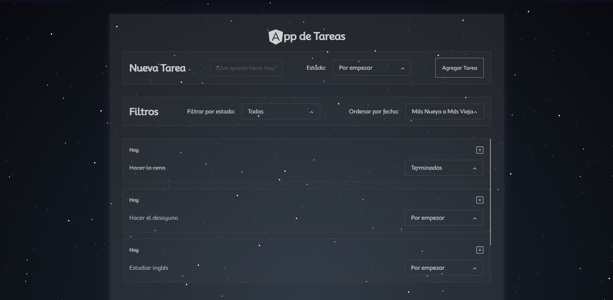

# TodoList App en Angular

Esta es una aplicación de lista de tareas desarrollada en Angular. Permite a los usuarios crear y eliminar tareas, así como aplicar filtros y ordenarlas según sus necesidades.

## Características

- Crear nuevas tareas.
- Marcar tareas como terminadas, en proceso o por empezar.
- Eliminar tareas.
- Filtrar tareas por estado (Terminadas, En proceso o Por terminar)
- Ordenar tareas por fecha de creación.
- Interfaz de usuario intuitiva y atractiva.
- Totalmente responsivo y compatible con dispositivos móviles.

## Capturas de Pantalla



## Requisitos Previos

- Node.js y npm instalados en tu sistema.

## Instalación

1. Clona este repositorio en tu máquina local:

   ```bash
   git clone https://github.com/MRegit/TodoApp.git
   
2. Instala las dependencias del proyecto:
   ```bash
   cd TodoApp
   npm install
   
3. Inicia la aplicación localmente:
   ```bash
   npm start
